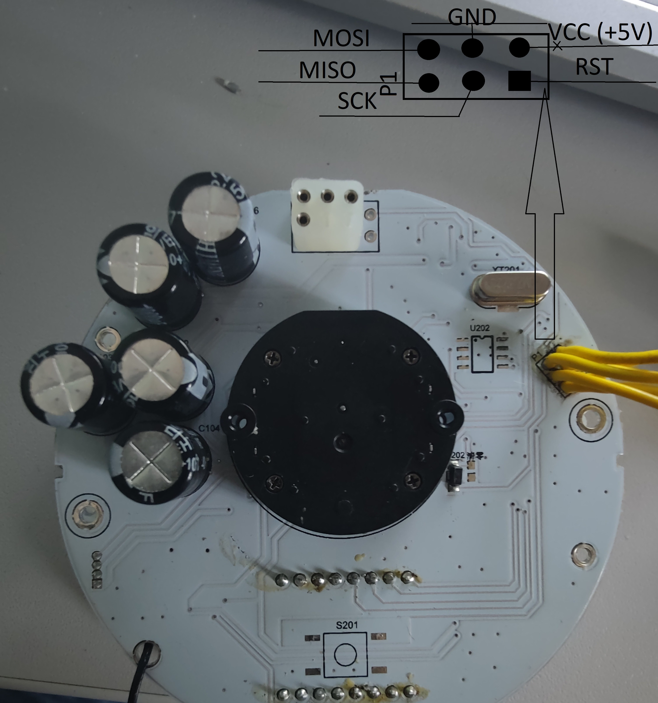

Для маніпуляцій нам потрібно програми:

- Notepad++ або блокнот для редагування файлу
- Avrdude 6.3.1.1 для прошивки контроллеру
- zadig-2.9 для встановлення драйвера для usbasp

Підключаємо програматор без інших підключених до нього пристроїв та встановлюємо драйвер.

Підключаємо програматор usbasp до спідометра за допомогою роз’єму P1 використовуючи дану розпіновку:

Підключаємо програма тор до ПК.

Для заміни цифри отримаємо EEPROM з контролера для цього виконаємо в powershell команду (в папці з програмою avrdude):

.\avrdude -c usbasp -p m88p -U eeprom:r:eeprom\_backup\_test.hex:i

Бачимо в першій стрічці файлу щось на зразок:

:100000000000000000000000000000006588000003

Зеленим виділено цифри що відповідають за відстань а синім контрольна сума стрічки (її може порахувати і підказати сама програма для прошивки)

Для зміни числа беремо потрібне число (наприклад 43834) та конвертуємо в шістнадцятко вий формат за допомогою сервісу

[Decimal to Hex Converter (thecalculatorsite.com)](https://www.thecalculatorsite.com/math/decimal-to-hex.php)

Отримаємо: ab3a

Та заміняємо в першому рядку те що виділене зеленим (якщо нове число займає більше ніж 4 символи, наприклад 6 то ми вставляємо це нове значення і **зліва** прибираємо перед ним два нулі щоб рядок був тієї самої довжини)

:10000000000000000000000000000000ab3a000003

При спробі прошити зі зміненими значеннями:

.\avrdude -c usbasp -p m88p -U eeprom:w:eeprom\_backup\_test.hex:i

З’явиться помилка і в ній вже буде підрахована правильна контрольна сума рядка

![](data:image/png;base64,iVBORw0KGgoAAAANSUhEUgAAAmAAAAAlCAIAAABqA8JxAAAAAXNSR0IArs4c6QAAD0tJREFUeF7tXU1oXMkRbumaTQ7ZHEbrZbBiJwKf5NhmLhMfNsJimJMPsg0RskAgxBIbhNlD/DOEiXcJLELYhkVIKNiKAnF8MBgLoUXrg9FFSI51sYk20soMtqVDorNvTvXr9/r9dfXPzJvV4KlBB/tNveqqr6u7X1fXvK+DXfjrixuFmZnqrcfvGX0IAUKAECAECAFCwEOgk3AgBAgBQoAQIAQIgTQCnez7nRq/3NUkdE5eqv7vwdmT1tpd5a0VN1GQ27w6Hf55/r5nn375IHkRjMCuC/uGJuQtnw95V/TyjXsl9N8vN6pJ6Fm/9GmjijK9P0DPBzNT3W7KssLZrVVPOhKfSRyajU+G+t/3nF0PRpk+zN6XP4fBCCEt/1EHaAd1S1Zx0prjsXFUs8KHT60WcdLJ/vXnP/7NWyLp0wgCK7MfF0b9v4GH64GqnfkqXPx5oTrFSksTBdmC8jqsjpPM1zO+0jsZebDA9DRiMt3bOAIH9Tzn1O76nQoPwupG4/46aYAJaH91lD3NoF2YFr+6WWLeaIK/k3de6yzZ2t0Jv97b2nKymoQdEHCKQ43erPQ4mA6iFnHCU6wbfyl99/2um2qSdkGgg71++HSP5T9J7KSj1+EB+XJxb2p6VSi+d2V2OV/6Ir6xw/S42NJesoDYtQGYUr+Zay+/bb1tHj7vWeGfFTZeqFz9wdYYrdyho/m9pW+162Lsfm9djM2AmZhBSj4wBAxx4p9B/vf5S+F3OsXn5WfCzAzE/f1VP5PGv5ooiI0q/EXzHlLP0mBOaE5sjfldkR1SWj5pj12eNrQ/kPczM8HuTVgrTU3LB9ZyN52Sw5rAAdC+GMztPF2TO0vZirx+6szx7trzh5u+mg62urDCjvwylrFM6xHdYW9nNE8Vv0smhKtf9oSuoPhE8l3p1oPEWqgqEld+OheLB95BEwUhf78srIqZlMBZI69JLSrs0baLjItpHt750pKf+gvtdMUZCx7Xdp1mLyU+Qb94ccX/rOIh3S4E8HnH55L4aUL9WfGOzYcnC5Vrm0z+Q5qHxbNi3vCPHiQO4TEENu8p7XeN58DU8IAmevyRjgd/JrEej+i4w/1VBpUIHiz+zTh7OXD46PXg8Ww7X2nmf02cyHa9BbJ34HT5d8LW8hM/TyhTfGt3FpZZb1luZcon+tjGbZniKI7sD+/2QwJnaJENjoq5NZoq7J/fMw5aTD6WcqyVlkxrpFIeUDgxtLhTHOFnEvypthfSlSJF46pf50hxJDyDjKRSuwcrcH1/deRI0KhQor5ee5tYQbsPH9LJG5GNC/CU11xpu6pIBfdVKkfv8uvjK7mxm/6ZMYaPRg80yLNhDypjbLHfm6REXE3m4b9+u+cXTHYXRy6/qkLkeFZVp2q5/jPao01EHkstovYgepTjQijn4V2Trvn+uuKMweHargnW5Pea1Gtfpbw1ZBsPru0q5f2wqflHDP3zuUnvuVw80cII6mO5sTmxZte5dmLxrJkH+iojzBsvXjRG2k3Ne5j93FnXeGZMjsdou8p44CMOH9fK8ajpL9Tf1D2a+MfwVI47jR6tnbbzlWb+t4nbTvabG4t//1PXR1wYbJWT170nG+J+eBL8GoLjM//87OJnvWzlWSRhtTEujtw2326z3NGjLJEqNBqBycNiVo6mHKcXd/LHz0Y2NwnNGnnAaAxcGD771cRI38qsWB31+r3n39GPI6eJBkeiZ5BX/DQp3AKLMT+ATB3ypq8fO+xvtZUNYXqc7PT6bla5Pi1XR8V12e8afDR6GDvEV0eY5hLQafsu5XLwBFZb/Nq4mvKbXeUZU9uj1qMcF5p4cMJZo8e1XeNYsxdYrvqLvU082KvVSfac6s9vjAdjRz6Xdyx8453izy6zvSlvza4vYY7Fs34ekOPCsyfXE84/yXmPIfZ7LjvHp7JdLB7qGY9IT+D+2nayYd52mwfQRp3mK+X8b+lP54U/DOdBdpevcdG80H6lV6pY+/b5TvEEf5qLL1pcIFgsxUwdTL57m0Gq0M4OlXzPJ0fCZ8Zp2Pp063Vp5dfuTEOZzFgxHIHMVb+dJ2kpOOa5enej+/Sp9AFk9PrLV7FDSngg7cmznVdvpEJMj6VdQuHyk3DxNtyI4KPX0z04MpZqBQZ2/zzzH/9NaQBLdxoRc7UHGxdKG5xxxj1xarcRQKzubfZ4OdoVH+BvtrKtHcTsd/CLbwD8T3rea6L9frvKeKhjPFp1NxeK+Gt9j2ZedR139m1ySdf53057568Oc8HdN9s8/TgX1onFat4215ZqXpYV8quRczK8ieijlo0hmLx8ZhRPjv5TLa4RlT91aRS2NYnSUBY+k1rqt/FFJbPwCJbnRMUNl4tcX/sBFsiuY+HdUJXAtn+IVyVgeqztShxqmu5D8cT08J1udaOvkjw19LN5qWpekwHN+t7eHt24wK1zxFmhqL52m4WXr9d1PDZiDo//rD+Y/RZ+8fnXqSA2I/uDdvXx4DoezcA6+xtVieJpP+7MFiokXOd/cyN+kc5Pf/aLqKw4q5NXxN4Fsqywl1++G/6GQa3ey7WKQyNIjssiHSEsUrXwKPRM6sfk+aqcGxsNfxoRs9A/lI6cCuDynhl7kL0RpaFT4rd6ev2OxS96pEX1KeR4lVWs/nVY/Gq9k8H55UXIBqcSjGk99kU64t7u4JzYHBoIPkY9kBPz9ouKyhq4dzO+LVDEg9myzCTS9uhVJ8YFCHuPNbHMvxGfOqy3abcOtW63aMeLmyql9MIzqHXQx39DrWD22/l1cbTUvbIgztTVn+bYr2w3Gg/GeFOOR+O4M/vroZCOf/28KqBLjzuFHk8y2DRbnDq7zv92wdT5n1dc8KNfF8RZY1A8Ut6a34hpgO4vjkwWNxZMZ0Kg5xwv2PGKU6B+J/j1FV9lr/NiGX59rut2eB2XH6hO5SPFL9rsHNevkucn2Lww5xGcm0ofoWAHk7fDLSUVLdJR2cnT1HJtjtwtryfs4T+IVJ2AYnpszI6lOEy1rxp8jHpAgBf7zPmFatGSUV6t450zYfFg44iNjCwp9A4LeicjBZlKezCd+nEBs4/wNFrwacTHxv462lWqxXDQ4KPU4zpe3PWvnoODxmAc8TixrwCwABSzX+9XX8V/cQcfj5HagnSDfN7Lzv50u5p4MMZbdDzqx529v/5Sl4p/DZ6acaccRxa9Goq4zv+WyjsYuzC1eOPfSzO3Hr+1vIfECAFCgBD4sBEQValQ2m0uuv4ggGg3fy07DVKs/xgr/f67dXpRgCViJEYIEAKEACHQFgjADpJ/urq69n7y27bwmJwkBAgBQsCEQFN3VPwQkf+yU/GRP2AwGZjx90p/W9DOjN02qaMF0oQQfU8IEAKEACHQlggQ3VVbdjs5TQgQAoQAIWBCgBZIE0L0PSFACBAChEBbIkALZFt2OzlNCBAChAAhYEKAFkgTQvQ9IUAIEAKEQFsi0PQF0pUJ01W+ZXstK+brg2UGx2hr6ob9g+lfSwTq9rc94wennbLEm8QIgSwRaPoCmaWxpOvHRYDT1ng0VZyQhJWWIjReP64hB99a3evcwZt+cBa4xo+r/MF5Ri23CwK0QLZLT7v66TO3XOev3hUv42XFcpRL2VUhybcVAq7x4yrfVmCSsweFQHKBRBjMw3fFirdjr3vv+8aYteErqUe+rBxjshaep+UT19O09UrIFCka8VrzYPcj+FeF/dF2E/rtXwIu9LgyyGOpS1yP14rH+h0leY++3lAwdKOM4eD4REHI3y8n9SjA5MzYPg0Z/xHxcK+gv9EwdGtwwPrXNe6V+DgxuQf4JJniMdwaZE5PvKwf85fihzMFqeItQEwyyPsv+HWNHJInBOpAILZAKhmrJXOpr53HccD/CZdSzNpi1eHv9vUY5DnluumDyWuYvrHVUbY7XisteS8N1zBKu+pHZzec0Vsyg/NXWt/02Tywdl2ZwZUM3TqwVczm/qMAf5d3+CfWWlbbfSmoV1bhpZQ+7bMGT8x+13hwwrk+JvemMqe7+qvp97aKH2W8iWCQOMB80lex4HYwzTn0PSFgg0BsgVQyVou3yAt6FPh47NXPgBkj+CSZtWE+vVzcm5q2JebF5A3M1CnnNPJKRmm9fsH/rOTTSMPqxCCvabceZnA3hm4Fs7nvqfc0I//kC5qPXaruzx1fGho9F2FxwRi6lfa7xoMmatX41MXk3jzm9Dr8pfiRna6MN/i28f6ymQ1JhhBIINC5vb394sWL8+fPwxcYgzmnWCqeGOLpu0I5sfilmbV5C35qzhpulbwD07fXjiujtKt+xBlnBnmk3TqYwTNh6NbtIPOlydPP+32e6hgB7NqdaSjbGStuAMumAEZrv2s8KLBG9WfA5J4xc7pT/FP8hJ2Nx1s8IOrqL+vJiAQJAYlAuIPUMVZzLsreMqTdIL9ae/5QwxrqK8719DiBjMlbMH3H2nFllHbVjzrlyCCPtuvKDN44Qze6g9za3YEnd8mPzdf1kA301KXRsdrs+ErvZJz8ErHfNR4awdmRyb0pzOnO/lL8MG28hQHRUH85TUokTAgwdRVrgsFcFDFClhVyQeGMiaG3+Xab5frP8CoYOFxJFCkomKwxeS3Tt4Jp2pVRWq/fq0WyqQwyMnoncULaNepRMoML5WmGbiNjuDH2IY96e4X1DfNzU37OdxMY1f3Uutete7B3vHdldjlggUbt18ZDsH81nyqh+htjck8wp2O4OTCna/1Nw27s93aJHzzeoghYMt0bw5sECAEbBMIFUs9gzmAaKo5MFsM9BKadM2sPLbLBChR97A/v9lc35CR+9frijscYvj/XdTu8jssPVKfyXN7/i29WEga4Mkq7MqRr0DQyekfv1bRr1BNlBgedSoZuPWO4TUxImXtXvJ8/Qn+tVmC/KBjVeUVJpXdn/hGcQ8uYEUU9SvuxeAhaebNVg396+QnTB9XvzuSuYmx/rYxPP3qtmdNN/iqcNPZ7m8SPMt6E765M96ZQou8JASsEOuAM8t27dzMzM7cev7W6g4QIgUwRgFrcpUE2NVS5Zk7dZ9BwU3n+MrCPVBAChEDLIEAvCmiZrmhLQ2C5Ons6x6wOttsSIHKaECAEDg4BWiAPDvu2b5lna0XydoC/r4c+hAAhQAi0FAKUYm2p7iBjCAFCgBAgBFoFAdpBtkpPkB2EACFACBACLYUALZAt1R1kDCFACBAChECrIEALZKv0BNlBCBAChAAh0FII/B8ddzJqIyXM1gAAAABJRU5ErkJggg==)

далі нам потрібно взяти два останні символи що пропонує утиліта та вписати їх замість двох останніх символів першого рядка

:10000000000000000000000000000000ab3a00000b

Далі зберігаємо файл і прошиваємо командою:

.\avrdude -c usbasp -p m88p -U eeprom:w:eeprom\_backup\_test.hex:i

відключаємо програматор і все готово!
